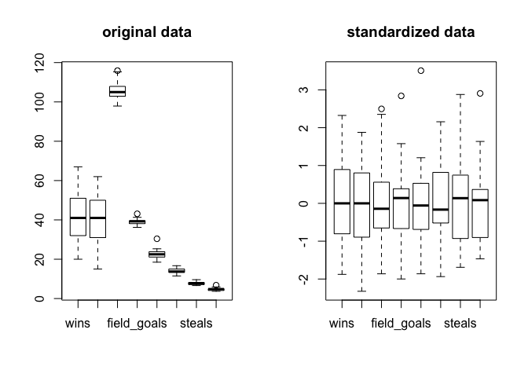

PCA
================
Eunjee Na
2018-11-15

**Principal Components Analaysis**
==================================

-   An unsupervised learning approach that allows to study and explore a set of quantitative variables meased on some objects
-   We seek to **reduce the dimensionality** of a data set while retaining as much as possible of the variation presetn in the data -- summarize a data set with the help of a small number of synthetic variables (called Principal Components) -- visualize the position of individuals -- visualize how variables are correlated **&lt; Usage &gt;**:

1.  Dimension Reduction
2.  Visualization
3.  Feature Extraction
4.  Data Compression
5.  Smoothing of Data
6.  Detection of Outliers
7.  Preliminary process for further analyses

NBA Team Stats : Regular season 2016 - 2017
===========================================

The data is available on [here](https://www.nbastuffer.com/team-stats/)

30 teams and 27 variables.

    ## [1] 30 27

    ##  [1] "team"                  "games_played"         
    ##  [3] "wins"                  "losses"               
    ##  [5] "win_prop"              "minutes"              
    ##  [7] "points"                "field_goals"          
    ##  [9] "field_goals_attempted" "field_goals_prop"     
    ## [11] "points3"               "points3_attempted"    
    ## [13] "points3_prop"          "free_throws"          
    ## [15] "free_throws_att"       "free_throws_prop"     
    ## [17] "off_rebounds"          "def_rebounds"         
    ## [19] "rebounds"              "assists"              
    ## [21] "turnovers"             "steals"               
    ## [23] "blocks"                "block_fga"            
    ## [25] "personal_fouls"        "personal_fouls_drawn" 
    ## [27] "plus_minus"

Active and Supplementary Elements
---------------------------------

#### *Variables*

`Active variables` (used to compute PCs) : wins, losses, points, field\_goals, assists, turnovers, steals, blocks

`Supplementary variables` (Not used to compute Pcs, but taken into account for interpretation) : points3, rebounds, personal\_fouls

#### *Individuals*

`Active individuals` : All 30 teams in season 2016 - 2017

`Supplemenatry individuals` : Warriors, Cavaliers in season 2015 - 2016

Before start
------------

Need to `standardize` the data X; meaning centering by substracting mean of each column and scaling by standard deviation of each column. ( X as a data with 8 active variables mentioned above )



Matrix decomposition : EVD and SVD

### EVD

`EVD`:(eigen value decomposition) : square matrix only
$$ R = \\frac{1}{n-1} X^\\top X = UAU^\\top$$
 *U*: orthonormal matrix by columns (*U*<sup>⊤</sup>*U* = *I*)

*A*: diagonal matrix of eigen-values (*λ*<sub>1</sub>, ..,*λ*<sub>*r*</sub>)

When *M**x* = *λ**x*, *d**e**t*(*M* − *λ**x*)=0, roots *λ* are eigen-values of *M*, *x* is e-vec of *M*

1.  Sum of e-values = ∑(*λ*<sub>*r*</sub>)=*p*, number of variables. -- $\\frac{\\lambda\_k}{p}$ is proportion of variation captured by each PC
2.  Production of e-values = ∏(*λ*<sub>*r*</sub>)=*d**e**t*(*M*)

Principal Components
====================

PC (scores) : *Z* = *X**V*, where *X*(nxp) is the standardized data, *V*(pxr) is `Loading`, a matrix of e-vectors. (r, rank of X)

prcomp()
--------

``` r
pca <- prcomp(X, scale=TRUE) #sdev, rotation, center, scale, x
#### default : scale =FALSE
```

-   sdev: std of PCs. var(Z) = e-value, so `sdev^2 = e-val`=*λ*
-   rotation: `V, loading`
-   center: vec of means of raw data X
-   scale: vec of sd of raw data X
-   x: `Z, scores, PCs`

princomp()
----------

``` r
pca2 <- princomp(X, cor=T) 
#### default : cor=F, Should TRUE to use Correlation matrix
names(pca2)
```

    ## [1] "sdev"     "loadings" "center"   "scale"    "n.obs"    "scores"  
    ## [7] "call"

### How many PCs?

1.  Screeplot (elbow)
2.  Predetermined amount of variation (ie. 70%)
3.  Kaiser Rule (*λ*<sub>*k*</sub> &gt; 1)
4.  Jollife Rule (*λ*<sub>*k*</sub> &gt; 0.7)

#### 1) Screeplot/Bar-chart

``` r
eigen_values <- (pca$sdev)^2
par(mfrow=c(1,2))
plot(eigen_values, type='o', xlab="Number of Components", ylab="eigen values", main="Screeplot")
barplot(eigen_values, xlab="Number of Components", ylab="eigen values", main="Barchart")
```


Where is the elbow? : *2 componenets*

#### 2) Table of EigenValues

``` r
eigen_values <- round(eigen_values,2)
proportion <- round(eigen_values / dim(X)[2] * 100 , 2)  # because sum of e-val = p (num of variables)
cum_prop <- cumsum(proportion)
eval_table <- cbind(eigen_values, proportion, cum_prop)
row.names(eval_table) <- c(paste0('PC',seq(1,8)))
eval_table
```

    ##     eigen_values proportion cum_prop
    ## PC1         3.68      46.00    46.00
    ## PC2         1.62      20.25    66.25
    ## PC3         1.02      12.75    79.00
    ## PC4         0.62       7.75    86.75
    ## PC5         0.47       5.88    92.63
    ## PC6         0.46       5.75    98.38
    ## PC7         0.13       1.62   100.00
    ## PC8         0.00       0.00   100.00

If predetermined amount of variation is 60% or 70%? : *2 components*

If 80%? : *3 components*

#### 3) Kaiser rule

``` r
T <- data.frame(eval_table)
T[T$eigen_values>1,]
```

    ##     eigen_values proportion cum_prop
    ## PC1         3.68      46.00    46.00
    ## PC2         1.62      20.25    66.25
    ## PC3         1.02      12.75    79.00

By Kaiser rule: *3 components*

#### 4) Jollife rule

``` r
T[T$eigen_values>0.7,]
```

    ##     eigen_values proportion cum_prop
    ## PC1         3.68      46.00    46.00
    ## PC2         1.62      20.25    66.25
    ## PC3         1.02      12.75    79.00

By Jollife rule: *3 components*

Z(scores), PCs
--------------

first 10 teams' PCs

    ##                          PC1    PC2    PC3    PC4    PC5    PC6    PC7 PC8
    ## Golden State Warriors -7.150 -0.848  1.324  0.369 -0.687 -0.606 -0.024   0
    ## San Antonio Spurs     -2.208  1.475  1.521  0.186  0.086  0.546  0.261   0
    ## Houston Rockets       -3.010 -0.294 -1.418 -0.842  0.194  0.454 -0.646   0
    ## Boston Celtics        -1.098  1.298 -0.827 -0.875 -0.869  0.340 -0.257   0
    ## Utah Jazz              1.200  1.961  0.770  0.147  0.341  1.686  0.295   0
    ## Toronto Raptors       -0.394  1.318  0.560 -0.162  2.078 -0.553 -0.401   0
    ## Cleveland Cavaliers   -0.699  1.290 -2.052  0.398  0.059  0.848  0.018   0
    ## LA Clippers           -0.805  1.313 -0.982 -0.232  0.295 -0.071 -0.195   0
    ## Washington Wizards    -1.986 -0.242 -1.002 -0.802  0.491 -0.878  0.492   0
    ## Oklahoma City Thunder -0.640 -0.197  0.208 -0.023  1.104  0.631  0.227   0

``` r
Z <- as.data.frame(Z)
percentage <- T[,2] #proportion of each PCs as a vector
percentage <- paste( colnames(Z), "(", paste0(as.character(percentage),"%"), ")")

PC1 <- Z[,1]
PC2 <- Z[,2]
ggplot(Z,aes(PC1, PC2)) + geom_point() + geom_text(aes(label=data$team)) + xlab(percentage[1]) + ylab(percentage[2]) + ggtitle("Scatterplot of individuals on PC1 and PC2") + geom_vline(xintercept = 0) + geom_hline(yintercept = 0)
```


``` r
ggplot(Z,aes(PC2, PC3)) + geom_point() + geom_text(aes(label=data$team)) + xlab(percentage[2]) + ylab(percentage[3]) + ggtitle("Scatterplot of individuals on PC2 and PC3") + geom_vline(xintercept = 0) + geom_hline(yintercept = 0)
```


Quality of Representation
=========================

When represeting *x*<sub>*i*</sub> into axis*k*, *d*<sup>2</sup>(*x*<sub>*i*</sub>, *g*) is squared-distance of individual *i* to teh centroid *g*. Since we normalize the data, *g* is the origin. *z*<sub>*i**k*</sub><sup>2</sup> is **projection of i** on axis*k*.

Thus,
$$cos^2(i,k) = \\frac{z^2\_{ik}}{d^2(x\_i,g)}$$
 represent the quality of PCs. - *c**o**s*<sup>2</sup> = 1 : `angle zero`, *i* is on axis*k* - *c**o**s*<sup>2</sup> = 0 : *i* is `orthogonal` of axis*k*

$$\\sum\_{k=1}^r cos^2(i,k) =  1$$
 *c**o**s*<sup>2</sup> values estimate the **quality** of the representation. The sum of each row from *c**o**s*<sup>2</sup> should be 1.

PCA using FactoMineR, factoextra
================================

`FactoMineR` for PCA `factoextra` for fviz\_.., and various pca related functions

``` r
row.names(X) <- as.factor(data$team)
fmr.pca <- PCA(X, graph=F)
fmr.pca
```

    ## **Results for the Principal Component Analysis (PCA)**
    ## The analysis was performed on 30 individuals, described by 8 variables
    ## *The results are available in the following objects:
    ## 
    ##    name               description                          
    ## 1  "$eig"             "eigenvalues"                        
    ## 2  "$var"             "results for the variables"          
    ## 3  "$var$coord"       "coord. for the variables"           
    ## 4  "$var$cor"         "correlations variables - dimensions"
    ## 5  "$var$cos2"        "cos2 for the variables"             
    ## 6  "$var$contrib"     "contributions of the variables"     
    ## 7  "$ind"             "results for the individuals"        
    ## 8  "$ind$coord"       "coord. for the individuals"         
    ## 9  "$ind$cos2"        "cos2 for the individuals"           
    ## 10 "$ind$contrib"     "contributions of the individuals"   
    ## 11 "$call"            "summary statistics"                 
    ## 12 "$call$centre"     "mean of the variables"              
    ## 13 "$call$ecart.type" "standard error of the variables"    
    ## 14 "$call$row.w"      "weights for the individuals"        
    ## 15 "$call$col.w"      "weights for the variables"

#### scree plot from factoextra

``` r
fviz_screeplot(fmr.pca, ncp=8) #dim(X)[2] = 8 = p
```


Around 70% of the information (Variance) are retained by the first 2 components.

Variables
---------

### Correlation circle

``` r
fmr.pca <- PCA(X, graph=F) # showing graph/ default : graph = TRUE
fviz_pca_var(fmr.pca, col.var='cos2') +
  scale_color_gradient2(low='white', mid='blue', high='red', midpoint=0.5) + theme_minimal()
```


The closer a variable is to the circle of correlation, the better its representation on the factor map.

Thus, *wins* and *losses* and *turnovers* are the three best representative factors.

Variables that are close to the center are less important for the first components.

### Quality of Variables

`how much each PC is repliable by specific variable`: Each row sum = 1

``` r
#First 6 variables with 4 PCs
var_quality <- fmr.pca$var$cos2
var_quality[c(1:6), c(1:4)]
```

    ##                  Dim.1      Dim.2        Dim.3      Dim.4
    ## wins        0.62434686 0.30961885 0.0029851667 0.02176220
    ## losses      0.62434686 0.30961885 0.0029851667 0.02176220
    ## points      0.66491233 0.03071487 0.2053083495 0.01585111
    ## field_goals 0.60439523 0.04362221 0.1110613868 0.10556124
    ## assists     0.58183324 0.02608895 0.0009209058 0.01008570
    ## turnovers   0.03815552 0.72448998 0.0024108022 0.02262005

### Contribution of variables to PCs

`contribution of variables to the construction of specific PC`: Every entry sum = 100

``` r
# Frist 6 rows of k = 1,2,3,4 (4PCs)
var_contribution <- fmr.pca$var$contrib
var_contribution[c(1:6), c(1:4)]
```

    ##                 Dim.1     Dim.2       Dim.3     Dim.4
    ## wins        16.963324 19.139290  0.29308321  3.502128
    ## losses      16.963324 19.139290  0.29308321  3.502128
    ## points      18.065476  1.898660 20.15714224  2.550873
    ## field_goals 16.421244  2.696535 10.90398991 16.987669
    ## assists     15.808241  1.612705  0.09041439  1.623064
    ## turnovers    1.036675 44.784818  0.23669219  3.640180

``` r
# contribution of variables on PC1
fviz_pca_contrib(fmr.pca, choice='var', axes =1)
```

    ## Warning in fviz_pca_contrib(fmr.pca, choice = "var", axes = 1): The
    ## function fviz_pca_contrib() is deprecated. Please use the function
    ## fviz_contrib() which can handle outputs of PCA, CA and MCA functions.


*Red dashed line* = the expected average contribution. $\\frac{1}{8} =\\frac{1}{p}$

    ## Warning in fviz_pca_contrib(fmr.pca, choice = "var", axes = 2): The
    ## function fviz_pca_contrib() is deprecated. Please use the function
    ## fviz_contrib() which can handle outputs of PCA, CA and MCA functions.


    ## Warning in fviz_pca_contrib(fmr.pca, choice = "var", axes = 1:2): The
    ## function fviz_pca_contrib() is deprecated. Please use the function
    ## fviz_contrib() which can handle outputs of PCA, CA and MCA functions.


``` r
fviz_pca_var(fmr.pca, col.var="contrib") 
```


``` r
# + scale_color_gradient2(low="white", mid="blue", 
 #                 high="red", midpoint=50) + theme_minimal()
```

Individuals
-----------

### Coordination of the individuals on PC

``` r
fviz_pca_ind(fmr.pca) #if there are classification factors, we can differ individuals' colors based on their factors
```


### Quality of Individuals

`how much each PC is repliable by specific individual`: Each row sum = 1

``` r
# First 6 rows for k = 1,2,3,4 (4PCs)
ind_quality <- fmr.pca$ind$cos2[c(1:6), c(1:4)]
row.names(ind_quality) <- as.vector(data$team)[1:6]
ind_quality
```

    ##                            Dim.1       Dim.2      Dim.3       Dim.4
    ## Golden State Warriors 0.93682873 0.013170110 0.03212084 0.002495688
    ## San Antonio Spurs     0.49881739 0.222735807 0.23665382 0.003536342
    ## Houston Rockets       0.72317632 0.006904138 0.16053335 0.056596224
    ## Boston Celtics        0.22852854 0.319227201 0.12961118 0.144959032
    ## Utah Jazz             0.16098822 0.429843158 0.06618774 0.002415628
    ## Toronto Raptors       0.02216717 0.247608673 0.04463893 0.003743516

*GSW* has a value close to 1 on PC1 while *Raptors*'s value is close to 0 on PC1.

### Contribution of Individuals

`contribution of an individual to the construction of specific PC`: Every entry sum = 100

``` r
# Frist 6 rows of k = 1,2,3,4 (4PCs)
ind_contribution <- fmr.pca$ind$contrib
ind_contribution[c(1:6), c(1:4)]
```

    ##                            Dim.1     Dim.2    Dim.3     Dim.4
    ## Golden State Warriors 47.8979178 1.5320017 5.934452 0.7557724
    ## San Antonio Spurs      4.5678923 4.6406383 7.831142 0.1918107
    ## Houston Rockets        8.4869097 0.1843437 6.807819 3.9340253
    ## Boston Celtics         1.1297516 3.5905074 2.315380 4.2445545
    ## Utah Jazz              1.3495386 8.1981272 2.004962 0.1199404
    ## Toronto Raptors        0.1457559 3.7042069 1.060638 0.1457941

*GSW* has a large contribution to PC1 while *Raptors* has a value close to 0 on PC1.

``` r
fviz_pca_ind(fmr.pca, col.ind="contrib") +
scale_color_gradient2(low="white", mid="blue", 
                  high="red", midpoint=15) + theme_minimal()
```


``` r
# contribution of individuals on PC1
fviz_pca_contrib(fmr.pca, choice='ind', axes =1)
```

    ## Warning in fviz_pca_contrib(fmr.pca, choice = "ind", axes = 1): The
    ## function fviz_pca_contrib() is deprecated. Please use the function
    ## fviz_contrib() which can handle outputs of PCA, CA and MCA functions.


    ## Warning in fviz_pca_contrib(fmr.pca, choice = "ind", axes = 2): The
    ## function fviz_pca_contrib() is deprecated. Please use the function
    ## fviz_contrib() which can handle outputs of PCA, CA and MCA functions.


    ## Warning in fviz_pca_contrib(fmr.pca, choice = "ind", axes = 1:2): The
    ## function fviz_pca_contrib() is deprecated. Please use the function
    ## fviz_contrib() which can handle outputs of PCA, CA and MCA functions.


